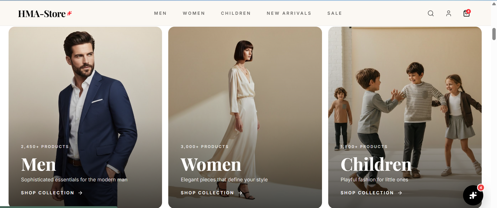
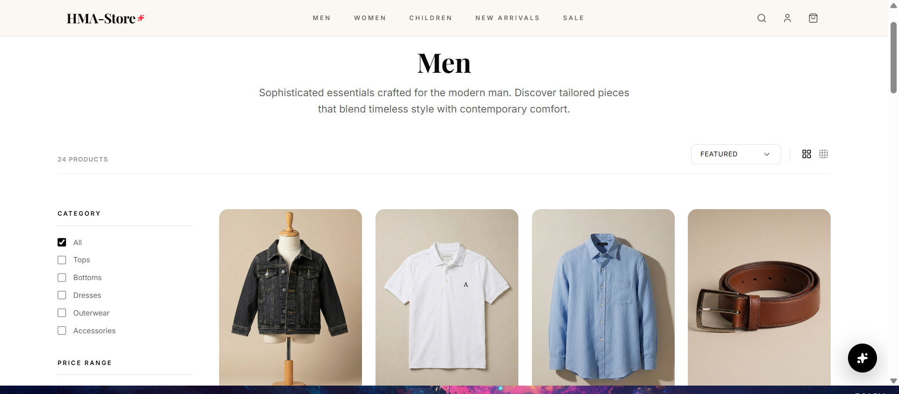
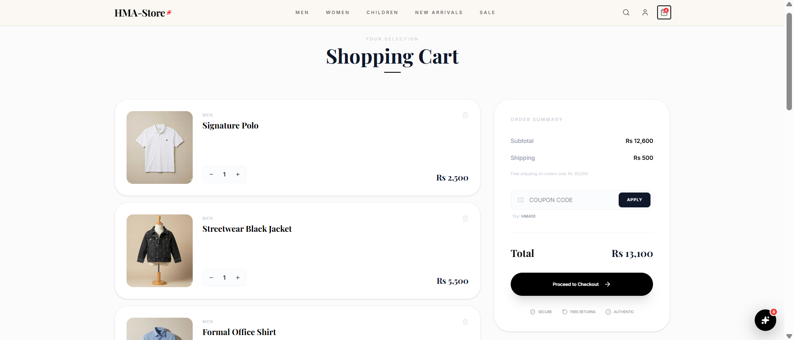

# 🛍️ HmaStore — E-Commerce Web Application


> A modern, full-stack e-commerce web application built with React, Node.js, Express, and MongoDB.

---

## 📋 Table of Contents

- [About the Project](#about-the-project)
- [Features](#features)
- [Tech Stack](#tech-stack)
- [Getting Started](#getting-started)
  - [Prerequisites](#prerequisites)
  - [Installation](#installation)
  - [Environment Variables](#environment-variables)
  - [Running the App](#running-the-app)
- [Project Structure](#project-structure)
- [Screenshots](#screenshots)
- [API Endpoints](#api-endpoints)
- [Contributing](#contributing)
- [License](#license)
- [Contact](#contact)

---

## 📖 About the Project

HmaStore is a fully featured e-commerce platform that allows users to browse products, manage a shopping cart, place orders, and complete secure payments — all through a clean and responsive UI.

---

## ✨ Features

### Customer Features
- 🔐 User authentication (Register / Login / Logout)
- 🛒 Shopping cart with real-time updates
- 📦 Product listing, search, and filtering
- 💳 Checkout and order management
- 👤 User profile and order history
-  Fully responsive design (mobile-first)
- 🪞 **AI Virtual Try-On Fitting Room:**
  - 📸 **Webcam Capture:** Snap live photos directly inside the browser fitting room modal.
  - 🔁 **Multi-Outfit Switcher:** Switch between similar products without closing the modal.
  - 🎨 **Fashion Loader:** Elegant, customized loading screen during processing.
  - 💾 **Save to Profile:** Save generated images directly to user profile dashboards with deletion and download functionality.
  - ⚡ **Client-Side Compression:** Dynamic resizing in-browser to fit Vercel payload limit boundaries (< 4.5 MB).

### Admin Dashboard Features
- 🎛️ **Comprehensive Dashboard:**
  - 📊 Real-time statistics (Total Products, Registered Users, Total Orders, Sales Revenue)
  - 📈 Category-wise analytics (Men's, Women's, Kids collections)
  - 🏷️ Product status tracking (New Arrivals, On Sale, AI Recommended)
  - 📉 Stock distribution visualization with progress bars
  - 🕐 Recent orders table with customer details
  - 🔔 Live activity feed (signups, logins, orders, password resets)
  - ⚡ Quick action buttons for common tasks

- 📦 **Product Management:**
  - ➕ Create, edit, and delete products
  - 🔍 Search and filter products by category
  - 📋 Responsive table view (desktop) and card view (mobile)
  - 🏷️ Product status badges (New, Sale, AI Pick, Regular)
  - 📄 Pagination for large product catalogs
  - 💰 Price management with sale pricing support

- 💰 **Sales & Revenue Analytics:**
  - 📊 Total revenue tracking
  - 🛒 Order count and average order value
  - 📈 Monthly growth metrics
  - 📅 Daily revenue & orders bar chart
  - 📊 Revenue by category visualization
  - 📉 Monthly revenue trend area chart
  - 📋 Revenue summary table with growth indicators

- 👥 **User Management:**
  - 📋 View all registered users
  - 👤 User details and activity history
  - 🔍 Search and filter users

- 📋 **Order Management:**
  - 📦 View all orders with customer details
  - 🔄 Update order status
  - 🔍 Search and filter orders
  - 📊 Order analytics and insights

- 📝 **Activity Logging:**
  - 🕐 Track all user activities (signup, login, orders, password resets)
  - 🔍 Searchable activity log
  - 📊 Activity analytics and trends

---

## 🧰 Tech Stack

### Frontend
| Technology | Purpose |
|---|---|
| [React](https://react.dev/) | UI library |
| [Vite](https://vitejs.dev/) | Build tool & dev server |
| [Tailwind CSS](https://tailwindcss.com/) | Utility-first styling |
| [React Router](https://reactrouter.com/) | Client-side routing |


### Backend
| Technology | Purpose |
|---|---|
| [Node.js](https://nodejs.org/) | JavaScript runtime |
| [Express.js](https://expressjs.com/) | REST API framework |
| [MongoDB](https://www.mongodb.com/) | NoSQL database |
| [Mongoose](https://mongoosejs.com/) | MongoDB ODM |
| [JWT](https://jwt.io/) | Authentication tokens |
| [bcrypt](https://www.npmjs.com/package/bcrypt) | Password hashing |

---

## 🚀 Getting Started

### Prerequisites

Make sure you have the following installed:

- [Node.js](https://nodejs.org/) v18+
- [npm](https://www.npmjs.com/) or [yarn](https://yarnpkg.com/)
- [MongoDB](https://www.mongodb.com/) (local) or a [MongoDB Atlas](https://www.mongodb.com/atlas) cluster

---

### Installation

1. **Clone the repository**
   ```bash
   git clone https://github.com/your-username/hmastore.git
   cd hmastore
   ```

2. **Install frontend dependencies**
   ```bash
   cd client
   npm install
   ```

3. **Install backend dependencies**
   ```bash
   cd ../server
   npm install
   ```

---

### Environment Variables

Create a `.env` file inside the `server/` directory and add the following:

```env
# Server
PORT=5000
NODE_ENV=development

# MongoDB
MONGO_URI=your_mongodb_connection_string

# JWT
JWT_SECRET=your_jwt_secret_key
JWT_EXPIRES_IN=7d

# Admin Credentials (Default - Change in Production)
ADMIN_EMAIL=admin@.com
ADMIN_PASSWORD=********

# HuggingFace (Required for AI Virtual Try-On)
HF_TOKEN=your_huggingface_write_token

# (Optional) Payment Gateway
STRIPE_SECRET_KEY=your_stripe_secret_key
```

Create a `.env` file inside the `client/` directory:

```env
VITE_API_URL=http://localhost:5000/api
```

---

### Running the App

**Start the backend server:**
```bash
cd server
npm run dev
```

**Start the frontend (in a new terminal):**
```bash
cd client
npm run dev
```

The app will be available at **https://hma-store-e-commerce-website.vercel.app/**

---

## 📁 Project Structure

```
hmastore/
├── client/                  # React frontend
│   ├── public/
│   ├── src/
│   │   ├── assets/          # Images, icons
│   │   ├── components/      # Reusable UI components
│   │   │   ├── Admin/       # Admin layout components
│   │   │   └── TryOn/       # AI Fitting Room Modal & Webcam components
│   │   ├── context/         # React context (auth, cart, admin auth)
│   │   ├── Pages/           # Route-level pages
│   │   │   ├── Admin/       # Admin dashboard pages
│   │   │   │   ├── AdminDashboard.jsx      # Main dashboard with stats
│   │   │   │   ├── AdminProducts.jsx       # Product management
│   │   │   │   ├── AdminProductForm.jsx    # Add/Edit product form
│   │   │   │   ├── AdminLogin.jsx          # Admin authentication
│   │   │   │   ├── AllUsers.jsx            # User management
│   │   │   │   ├── AllOrders.jsx           # Order management
│   │   │   │   ├── SalesRevenue.jsx        # Sales analytics
│   │   │   │   └── AllActivity.jsx         # Activity logging
│   │   │   └── [Customer Pages]
│   │   ├── hooks/           # Custom hooks
│   │   ├── services/        # API call functions
│   │   └── main.jsx
│   ├── index.html
│   └── vite.config.js
│
├── server/                  # Node.js backend
│   ├── config/              # DB connection, env config
│   ├── controllers/         # Route handler logic
│   ├── middleware/           # Auth, error handling, admin auth
│   ├── models/              # Mongoose schemas
│   ├── routes/              # Express routes (including admin routes)
│   └── index.js
│
└── README.md
```

---

## 📸 Screenshots


| Home Page | Product Page | Cart |
|---|---|---|
|  |  |  |

---

## 🔌 API Endpoints

### Customer Authentication
| Method | Endpoint | Description |
|---|---|---|
| POST | `/api/auth/register` | Register a new user |
| POST | `/api/auth/login` | Login and receive JWT |

### Admin Authentication
| Method | Endpoint | Description |
|---|---|---|
| POST | `/api/admin/login` | Admin login and receive JWT |
| GET | `/api/admin/dashboard-stats` | Get dashboard statistics (Admin) |

### AI Virtual Try-On
| Method | Endpoint | Description |
|---|---|---|
| POST | `/api/tryon` | Performs virtual try-on using public Gradio space |
| POST | `/api/tryon/save` | Saves try-on result with metadata to user's profile |
| GET | `/api/tryon/saved` | Gets all saved try-ons for the logged-in user |
| DELETE | `/api/tryon/saved/:id` | Deletes a saved try-on look |

### Products (Public)
| Method | Endpoint | Description |
|---|---|---|
| GET | `/api/products` | Get all products |
| GET | `/api/products/:id` | Get single product |

### Products (Admin)
| Method | Endpoint | Description |
|---|---|---|
| GET | `/api/admin/products` | Get all products (Admin) |
| POST | `/api/admin/products` | Create product (Admin) |
| PUT | `/api/admin/products/:id` | Update product (Admin) |
| DELETE | `/api/admin/products/:id` | Delete product (Admin) |

### Orders (Customer)
| Method | Endpoint | Description |
|---|---|---|
| POST | `/api/orders` | Place an order |
| GET | `/api/orders/my` | Get logged-in user's orders |

### Orders (Admin)
| Method | Endpoint | Description |
|---|---|---|
| GET | `/api/admin/orders` | Get all orders (Admin) |
| PUT | `/api/admin/orders/:id` | Update order status (Admin) |

### Users (Admin)
| Method | Endpoint | Description |
|---|---|---|
| GET | `/api/admin/users` | Get all registered users (Admin) |
| GET | `/api/admin/users/:id` | Get single user details (Admin) |

### Activity Log (Admin)
| Method | Endpoint | Description |
|---|---|---|
| GET | `/api/admin/activity` | Get all activity logs (Admin) |

---

## 🤝 Contributing

Contributions are welcome! Here's how:

1. Fork the repository
2. Create a new branch: `git checkout -b feature/your-feature-name`
3. Make your changes and commit: `git commit -m "Add your feature"`
4. Push to your branch: `git push origin feature/your-feature-name`
5. Open a Pull Request

Please make sure your code follows the existing style and passes any linting checks.

---

## 📄 License

This project is licensed under the [MIT License].

---

## 📬 Contact

**HmaStore Team**

- GitHub: [HarisShahnawaz](https://github.com/HarisShahnawaz)
- Email: harisshahnawaz97@gmail.com

---

<p align="center">Made with ❤️ by the HmaStore Team</p>
